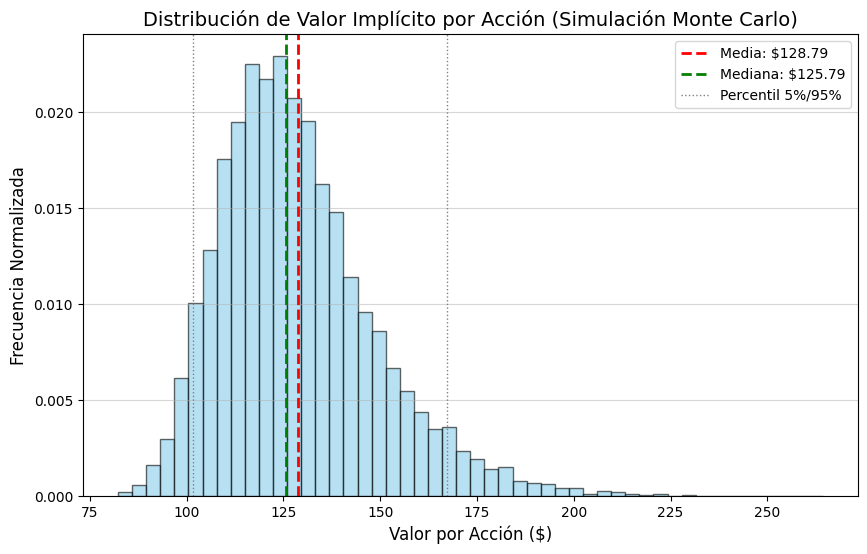

## DCF Valuation Model with Monte Carlo Sensitivity

This project implements the **Discounted Cash Flow (DCF)** model — a core tool in corporate finance — to estimate a company's intrinsic equity value.  
The model is enhanced with **Monte Carlo simulation** for robust sensitivity analysis.

The project features a minimalist, interactive **web application built with Streamlit**, allowing users to adjust all financial and risk inputs in real time.

---

### Advanced Features

- **Interactive Web Interface (Streamlit):**  
  Simplifies input and provides immediate visualization of results.

- **Two-Stage Growth Model:**  
  FCF projection uses distinct growth rates, reflecting an initial high-growth period followed by maturation.

- **Monte Carlo Sensitivity Analysis:**  
  Quantifies risk and uncertainty in key valuation parameters (WACC and long-term growth *g*), yielding a range of fair values rather than a single deterministic price.

- **Risk Indicator:**  
  A color-coded indicator displays the overall risk (Standard Deviation / Mean) of the Monte Carlo simulation.

- **Visualization:**  
  Generates a histogram using Matplotlib to display the distribution of simulated share values.

---

### Repository Structure

| File | Description |
|------|--------------|
| `dcf_model.py` | Contains the core valuation logic: FCF projection, Terminal Value calculation, and the Monte Carlo engine. This file handles the math. |
| `dcf_app_minimal.py` | Main entry point for the web application. Handles all user input (sidebar sliders) and result presentation via Streamlit. |
| `requirements.txt` | Lists Python library dependencies, including Streamlit, NumPy, and Matplotlib. |
| `README.md` | This document. |

---

### Project Setup

**1) Clone the Repository**

git clone [Your Repository URL]  
cd Company-Valuation-DCF

**2) Install Dependencies**

Install required libraries from the `requirements.txt` file.

pip install -r requirements.txt

**3) Execution (Web Application)**

Run the interactive Streamlit application using the following command:

streamlit run dcf_app_minimal.py

This command will launch the application in your default web browser.  
When executed, the app will automatically generate the `monte_carlo_distribution.png` file in the root directory for use in this documentation.

---

### Key Output: Monte Carlo Risk Profile

The **Monte Carlo simulation** is the core of the risk analysis.  
This output illustrates the probability distribution of the **Implied Value Per Share** based on the input uncertainties.

#### 1. Value Distribution Plot
Below is the histogram generated by the model, displaying the simulated fair value range.

#### 2. Quantitative Analysis
--- AI-GENERATED QUANTITATIVE ANALYSIS (COPY AND PASTE INTO README.MD) ---

### Key Model Inputs (Base Case)

| Parameter | Value | Notes |
| :--- | :--- | :--- |
| **Initial FCF (Year 0)** | $150,000,000 | Base for FCF projections. |
| **Net Debt** | $20,000,000 | Subtracted to find Equity Value. |
| **Shares Outstanding** | 25,000,000 | Used for Per Share calculation. |
| **Initial Growth (Stage 1)** | 20.0% | High growth rate for early expansion. |
| **WACC (Mean Discount Rate)** | 10.00% | Primary discounting factor. |
| **Perpetuity Growth ('g' Mean)** | 2.50% | Long-term growth assumption. |
This analysis interprets the simulated results, focusing on risk and valuation uncertainty. The Monte Carlo simulation, using the inputs detailed below, resulted in an average expected intrinsic value (mean) of **$128.94**. This mean is **very close to** the deterministic base case value, indicating that parameter uncertainty has a significant impact on the valuation's central tendency. The Standard Deviation of **$20.68** confirms the valuation's moderate volatility (Moderate Risk).. The spread of the 95% Confidence Range, spanning from **$97.59 to $176.34**, illustrates the broad impact that small changes in WACC and perpetuity growth ('g') assumptions can have on the final price.

-----------------------------------------------------------------------
